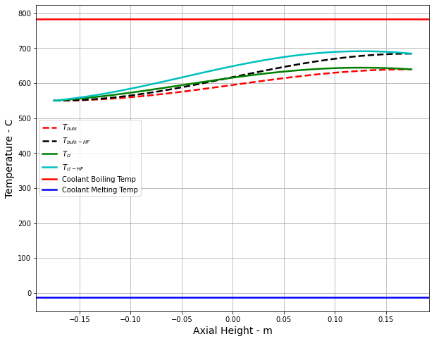
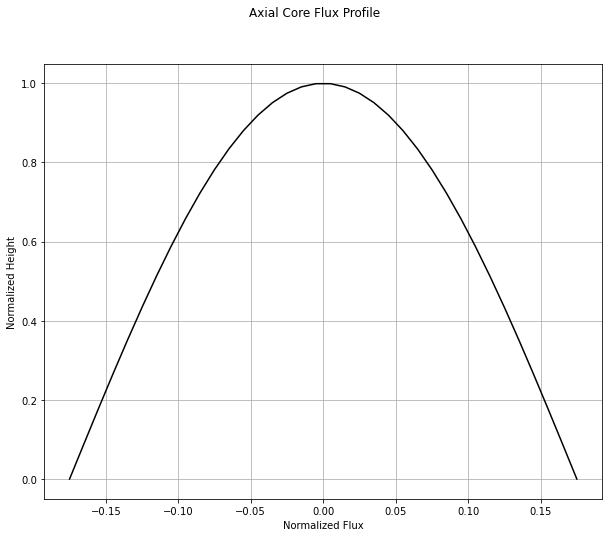

----------------------------------
Cladding Thermophysical Properties
----------------------------------

Cladding materials are a material that covers the outer layer of a reactor. 
This prevents radioactive material from being discharged. 
There were several things that were collected when finding the information for the cladding materials. 
First, the Thermal Conductivity of each material was collected. 
These Thermal Conductivities were averaged between 100°C and 1000°C. 
Then the melting points were averaged. 
The melting temperatures were found in both Celsius and Kelvin.  

Thermal conductivity for different cladding materials. The provided melting temperatures were added in Kelvin below.
.. _tab:setup:

.. csv-table:: Cladding Materials with Thermal Conductivities and Melting points
    :align: center
    :header: "Material","Thermal Conductivity","Melting Tempurature"
    :widths: 15,15,15

    "Graphite-384_1","90.016 W/(m K)","Not available"
    "Stainless Steel 304","21.8383333 W/(m K)", "1673.15-1728.15 K"
    "Stainless Steel 304L","21.83583333 W/(m K)","1673.15-1728.15 K"
    "Zircaloy-2","19.02 W/(m K)","2123.15 K"
    "Zircaloy-2 Nickel-Free","18.1725 W/(m K)","Not avilable"
                      
The eight cladding props collected are listed above. 
The information gathered was found in academic articles and web pages. 
The information was put into Python and a Clad Props library was created. 
Afterward, the new cladding materials file was added to the existing TACOCAT Software.
The following two graphs show the difference between the Thermal Conductivities of Graphiet 384_1 and Zircaloy-2.
As seen when viewing both graphs, there is not much difference in the two graphs. 
This is due to the Thermal Conductivities being averaged.
It is assumed that if they are not averaged, a bigger difference would be seen when the graphs were compared.

Graph produced using Graphite 384_1 data

Graph produced using Grapite 384_1

.. image:: Figure2023-09-26153218-Zirc_2.png
Graph produced using the Zorcaloy-2 data

.. image:: Figure2023-09-26153204-Zirc_2.png
Graph Produced using the Zorcaly-2 data
